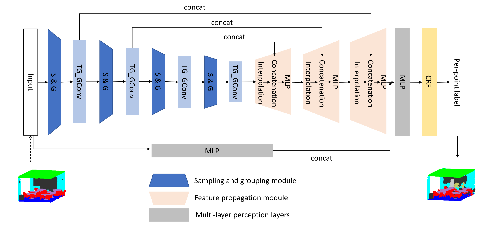

# TGNet: Geometric Graph CNN on 3-D Point Cloud Segmentation

Created by Ying Li, Lingfei Ma, Zilong Zhong,Dongpu Cao,and Jonathan Li from University of Waterloo
## Introduction
Recent geometric deep learning works define convolution operations in local regions and have enjoyed remarkable success on non-Euclidean data, including graph and point clouds. However, the high-level geometric correlations between the input and its neighboring coordinates or features are not fully exploited, resulting in suboptimal segmentation performance. In this article, we propose a novel graph convolution architecture, which we term as Taylor Gaussian mixture model (GMM) network (TGNet), to efficiently learn expressive and compositional local geometric features from point clouds. The TGNet is composed of basic geometric units, TGConv, that conduct local convolution on irregular point sets and are parametrized by a family of filters. Specifically, these filters are defined as the products of the local point features and the neighboring geometric features extracted from local coordinates. These geometric features are expressed by Gaussian weighted Taylor kernels. Then, a parametric pooling layer aggregates TGConv features to generate new feature vectors for each point. TGNet employs TGConv on multiscale neighborhoods to extract coarse-to-fine semantic deep features while improving its scale invariance. Additionally, a conditional random field (CRF) is adopted within the output layer to further improve the segmentation results.



## Installation
Install TensorFlow. The code is tested under TF1.4 GPU version and Python 3.5 (version 2 should also work) on Ubuntu 16.04. There are also some dependencies for a few Python libraries for data processing and visualizations like cv2, h5py etc. It's highly recommended that you have access to GPUs.

## Compile Customized TF Operators
The TF operators are included under tf_ops, you need to compile them (check tf_xxx_compile.sh under each ops subfolder) first. Update nvcc and python path if necessary. The code is tested under TF1.4.0.

To compile the operators in TF version >=1.4, you need to modify the compile scripts slightly.

First, find Tensorflow include and library paths.

    TF_INC=$(python -c 'import tensorflow as tf; print(tf.sysconfig.get_include())')
    TF_LIB=$(python -c 'import tensorflow as tf; print(tf.sysconfig.get_lib())')
Then, add flags of -I$TF_INC/external/nsync/public -L$TF_LIB -ltensorflow_framework to the g++ commands.

## Segmentation
To train a model to segment object:

    python Train_Paris_Lille.py

### ScanNet

### S3DIS

### Paris_Lille_3D

## Citation
If you find our work useful in your research, please consider citing:

```
@article{li2019tgnet,
  title={Tgnet: Geometric graph cnn on 3-d point cloud segmentation},
  author={Li, Ying and Ma, Lingfei and Zhong, Zilong and Cao, Dongpu and Li, Jonathan},
  journal={IEEE Transactions on Geoscience and Remote Sensing},
  volume={58},
  number={5},
  pages={3588--3600},
  year={2019},
  publisher={IEEE}
}
```
